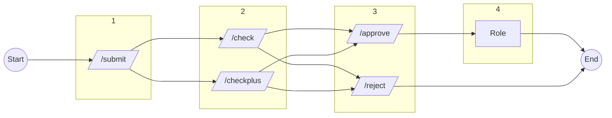

# QCBot
A Discord application to help manage voice model submissions in the AI HUB server.

## Workflow for submissions

Here's a simplified explanation of how the submissions review process works:

1. An applicant creates a submission.
2. A controller retrieves the submission.
3. The submission is reviewed by the controller.
4. If approved, a special role is granted to the applicant.

## Resources

Want to know how to use the bot in your own server or what its commands are? **Check out [QCBot's official wiki](https://github.com/Antasma245/QCBot/wiki)!**

## Special thanks
[@RayTracerGC](https://github.com/RayTracerGC)

[@Eddycrack864](https://github.com/Eddycrack864)

[@SleepyYui](https://github.com/SleepyYui)

[@AIHubCentral](https://github.com/AIHubCentral)
